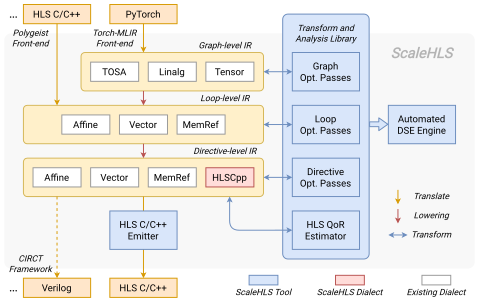

# ScaleHLS Project

[](https://github.com/hanchenye/scalehls/actions/workflows/buildAndTest.yml)

ScaleHLS is a High-level Synthesis (HLS) framework on [MLIR](https://mlir.llvm.org). ScaleHLS can compile HLS C/C++ or PyTorch model to optimized HLS C/C++ in order to generate high-efficiency RTL design using downstream tools, such as Xilinx Vivado HLS.

By using the MLIR framework that can be better tuned to particular algorithms at different representation levels, ScaleHLS is more scalable and customizable towards various applications coming with intrinsic structural or functional hierarchies. ScaleHLS represents HLS designs at multiple levels of abstraction and provides an HLS-dedicated analysis and transform library (in both C++ and Python) to solve the optimization problems at the suitable representation levels. Using this library, we've developed a design space exploration engine to generate optimized HLS designs automatically.

For more details, please see our [HPCA'22](https://doi.org/10.1109/HPCA53966.2022.00060) and [DAC'22](https://doi.org/10.1145/3489517.3530631) paper:
```bibtex
@inproceedings{yehpca2022scalehls,
  title={ScaleHLS: A New Scalable High-Level Synthesis Framework on Multi-Level Intermediate Representation},
  author={Ye, Hanchen and Hao, Cong and Cheng, Jianyi and Jeong, Hyunmin and Huang, Jack and Neuendorffer, Stephen and Chen, Deming},
  booktitle={2022 IEEE International Symposium on High-Performance Computer Architecture (HPCA)},
  year={2022}
}
@inproceedings{yedac2022scalehls,
  title={ScaleHLS: a scalable high-level synthesis framework with multi-level transformations and optimizations},
  author={Ye, Hanchen and Jun, HyeGang and Jeong, Hyunmin and Neuendorffer, Stephen and Chen, Deming},
  booktitle={Proceedings of the 59th ACM/IEEE Design Automation Conference},
  year={2022}
}
```

## Framework Architecture

<p align="center"></p>

## Setting this up

### Prerequisites
- python3
- cmake
- ninja
- clang and lld

Optionally, the following packages are required for the Python binding.
- pybind11
- numpy

### Clone ScaleHLS
```sh
$ git clone --recursive git@github.com:hanchenye/scalehls.git
$ cd scalehls
```

### Build ScaleHLS
Run the following script to build ScaleHLS. Optionally, add `-p ON` to enable the Python binding and `-j xx` to specify the number of parallel linking jobs.
```sh
$ ./build-scalehls.sh
```

After the build, we suggest to export the following paths.
```sh
$ export PATH=$PATH:$PWD/build/bin
$ export PYTHONPATH=$PYTHONPATH:$PWD/build/tools/scalehls/python_packages/scalehls_core
```

## Compiling PyTorch Model
Install the pre-built [Torch-MLIR](https://github.com/llvm/torch-mlir) front-end:
```
$ python -m venv mlir_venv
$ source mlir_venv/bin/activate
$ python -m pip install --upgrade pip
$ pip install --pre torch-mlir torchvision -f https://llvm.github.io/torch-mlir/package-index/ --extra-index-url https://download.pytorch.org/whl/nightly/cpu
```

Once Torch-MLIR is installed, you should be able to run the following test:
```sh
$ scalehls-opt resnet18.mlir -scaleflow-pytorch-pipeline \
    | scalehls-translate -scalehls-emit-hlscpp > resnet18.cpp
```
